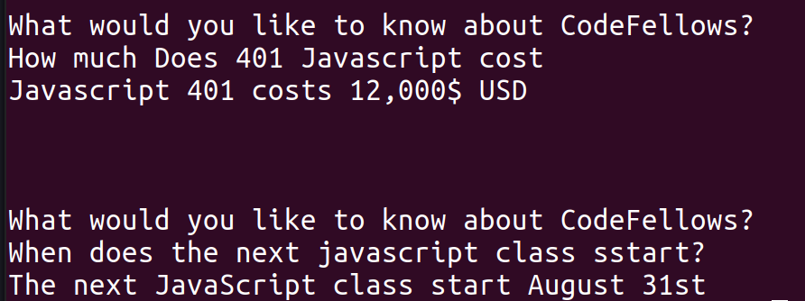

# Codefellows ChatBot

## Team: Lee-Roy King, Thomas Sherer, Roman Sydoruk

## Description
Chat bot which you can interact with on the command line to get questions about code fellows answered (command line input and responses).


## Wire Frames



## User Stories
https://github.com/orgs/CodefellowsChatbot/projects/2

## Software Requirements
[Software Requirements](./requirements.md)

## Domain Modeling
https://docs.google.com/drawings/d/1e66-ylESSl5mYymCikQwHw4gtOq5ZoySrtPB-eQhDbk/edit?usp=sharing

## Database
This app is not expecting to use a database.  


## Infrastructure/Orchestration
Primary build technology will be Docker and we will be deploying that container to heroku, but that should be easy to lift and shift to another hosting service if needed since it will already be containerized.

## Current build/deploy instructions

**build command**
```
docker build -t mvpflask:latest .
```

**run container locally (requires docker)**
```
docker run -d -p 5000:5000 mvpflask:latest
```
Should now be reachable on localhost:5000/ and localhost:5000/question


**heroku deployment** where `mvpflask` is name of app on heroku
```
heroku create mvpflask
heroku container:push web --app mvpflask
heroku container:release web --app mvpflask
```